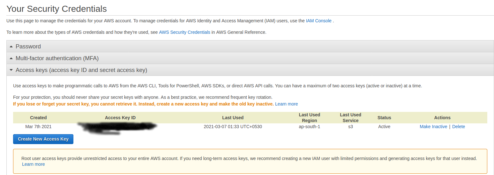
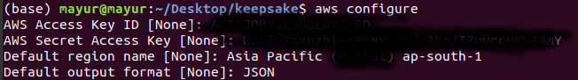
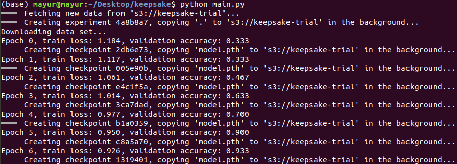
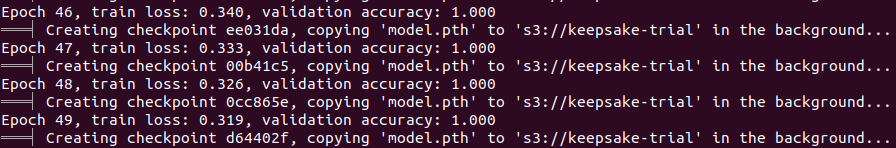
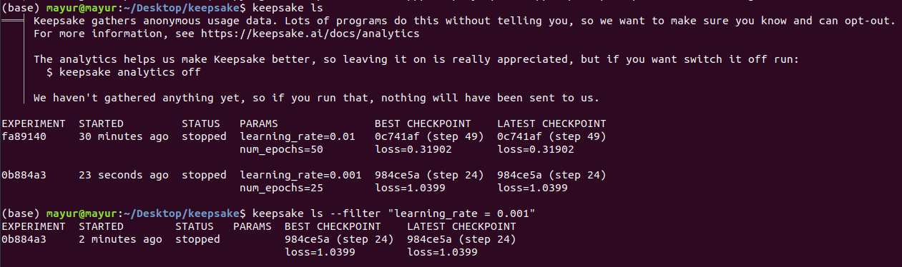
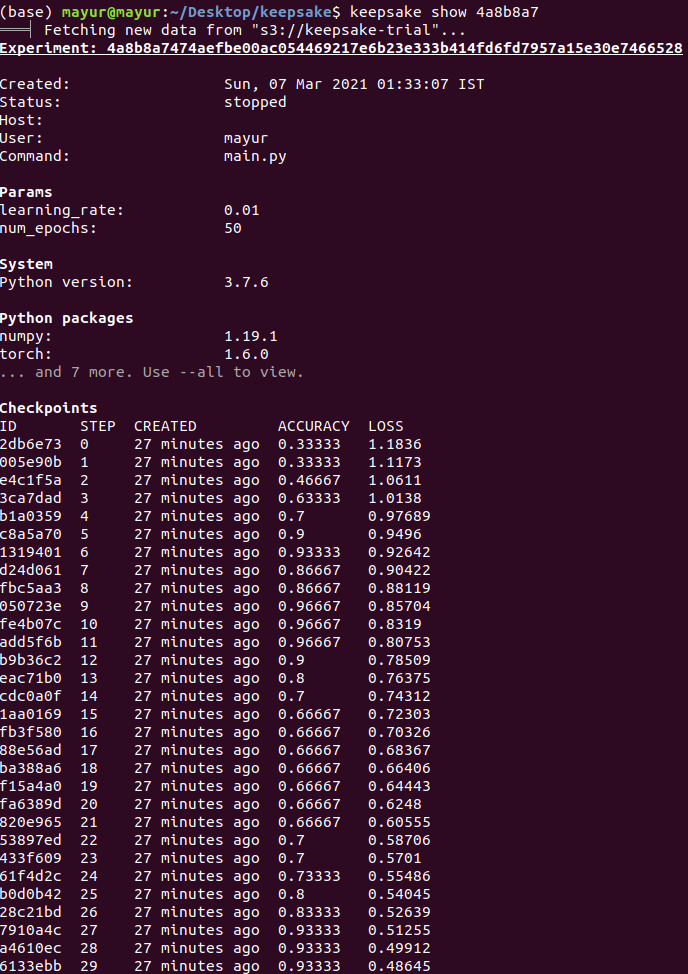
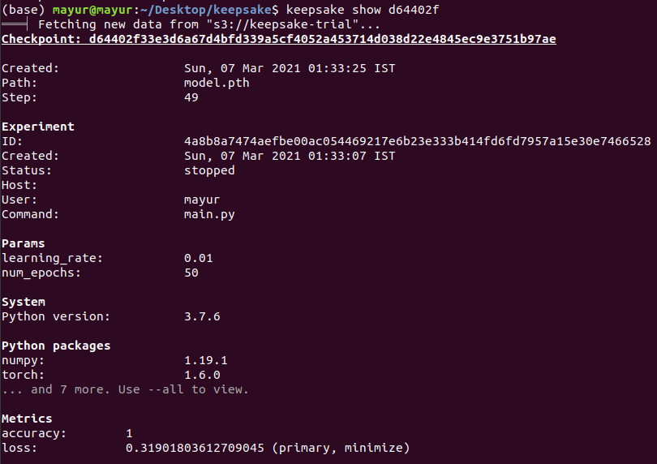
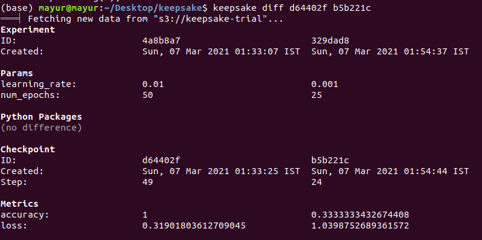
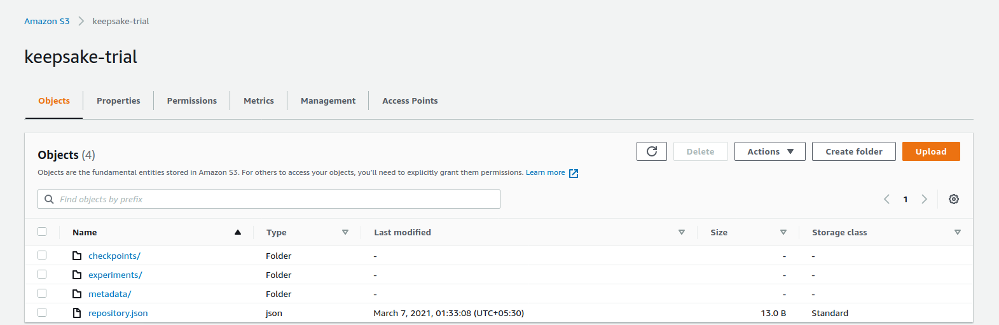

# Playing-with-Keepsake

Keepsake is a version control tool for Machine Learning. It's a beginner lesson on how to use keepsake and store result in AWS and in Local.

# Blog

* 📑 [Keepsake - A Version Control For Machine Learning](mayurji.github.io/machine-learning/keepsake)

### Installation

```
pip install -r requirements.txt
```

### Setting Up AWS

* Create a aws account (**Use Free Tier**)
* Get the access and secret key

### My Credentials From AWS Account



* Create S3 bucket
* Install aws cli
* Type the below command in the terminal

```
aws configure
```

* Pass the access and secret key
* From S3 bucket get the region.
* For last option, default is JSON

### My Credentials From AWS Account


### AWS Configure



### Run Experiment

```
python main.py
```



### Creating Checkpoint and storing in AWS S3 bucket



### Listing All ML Experiments using ls



### Show each ML Experiments using experiment id and show command



### Show each ML Checkpoint using checkpoint id and show command



### Show difference between ML experiments (checkpoint) using diff command



### End Result of Experiment is stored in AWS Bucket (keepsake-trial)


