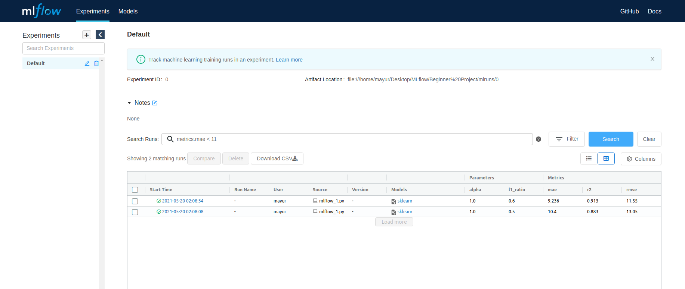

## Tracking ML Experiments Using MLflow



### Install

```python
pip install -r requirements.txt
```

### Steps

* Creating Conda Environment
* Installing Necessary Libraries
* Creating Machine Learning model file with mlflow trackers and loggers.(mlflow_1.py filename)
* Creating Conda.yaml using 
  ```python
  conda env export > conda.yaml
  ```
* Creating MLProject file
* **Run**

```python
# P refers parameter with alpha as hyperparameter of the ElasticNet Model.

mlflow run MLflow/ -P alpha=0.45
```
* Creates mlruns folder with experiments
* Using mlflow commands as below
  ```python
  mlflow ui
  ```
  - Runs the mlflow GUI interface on 127.0.0.1:5000
  - Filter experiments using hyperparameters and other tunable metric.

Note: If above steps are confusing, just follow two commands

```python
pip install -r requirements.txt
python mlflow_1.py 1.0 0.5
```
